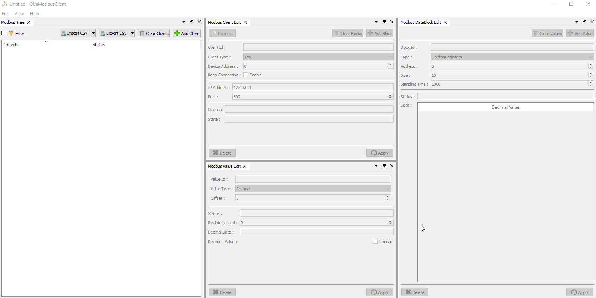
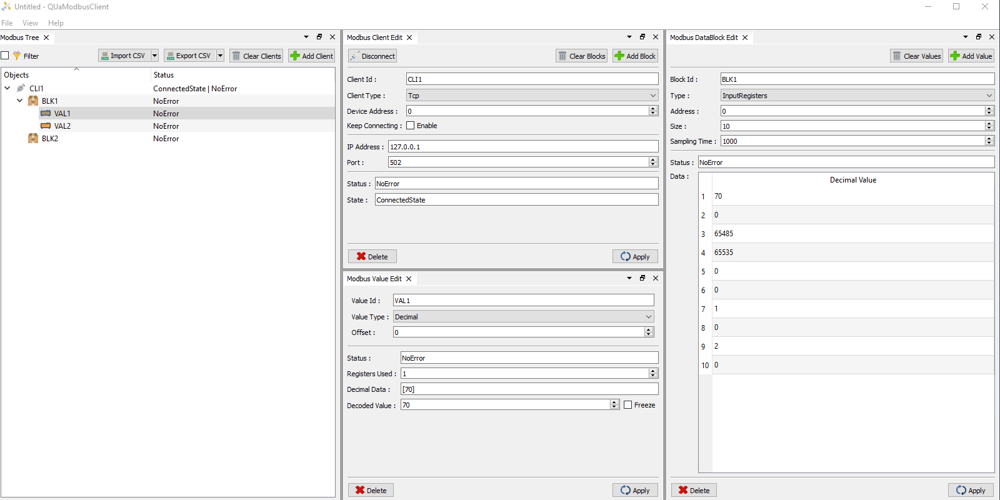

# QUaModbusClient

Modbus client to OPC UA Server Gateway.

**Easy to Configure**

<p align="center">
  
</p>

**Maps Values to OPC UA**

<p align="center">
  
</p>


# Download

* [Windows Installer](https://github.com/juangburgos/QUaModbusClient/releases/tag/latest)

* [Linux AppImage](https://github.com/juangburgos/QUaModbusClient/releases/tag/latest)

## Dependencies

* C++11 or higher.

* Qt 5.7 or higher.

* CMake.

* Python.

## Build

Clone this repo *recursivelly* to download the application's source code and the dependencies source code.

```bash
cd ${REPOS}
git clone https://github.com/juangburgos/QUaModbusClient.git QUaModbusClient.git
cd QUaModbusClient.git
git submodule update --init --recursive
```

Run qmake *recursivelly* to create project files for the application and its dependencies.

```bash
# Windows
qmake "CONFIG+=ua_events ua_historizing" -r -tp vc quamodbus.pro

# Linux
qmake "CONFIG+=ua_events ua_historizing" -r quamodbus.pro
```

Build using the generated VisualStudio solution (for Windows) or the generated Makefiles (for Linux).

```bash
# Windows
msbuild quamodbus.sln /m /p:Configuration=Release

# Linux
make -s -j$(nproc)
```